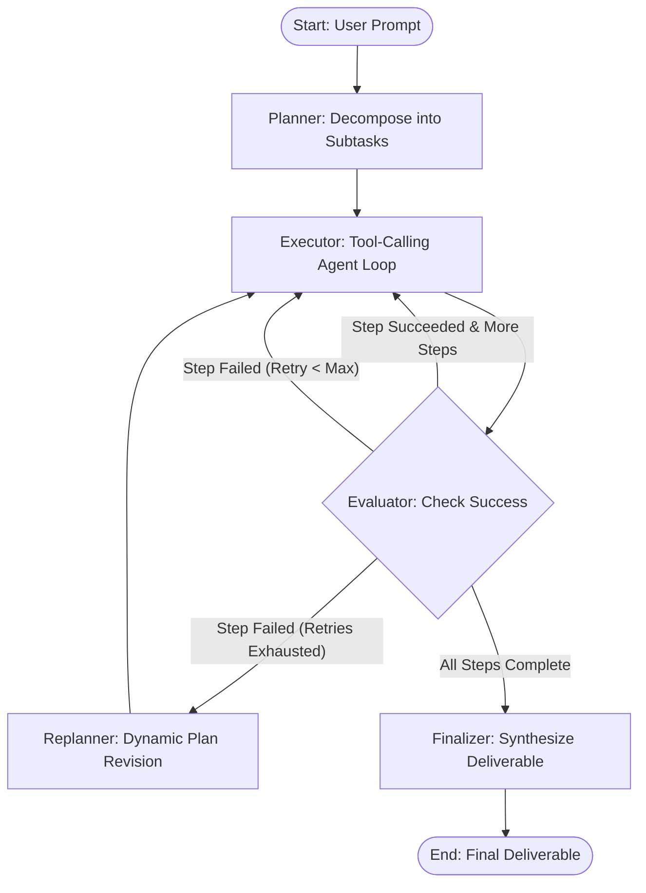

# 🤖 Autonomous AI Automation Agent

An autonomous AI agent built with **LangGraph**, designed to turn any user prompt into a structured, self-healing execution flow that accomplishes complex tasks end-to-end.

Supports both **Google Gemini** (recommended for speed and native tool use) and **Hugging Face** open-source models, managed with **uv** and linted with **Ruff**.

---

## 🌟 Features

- **Goal-Driven Prompt-to-Execution**: Give the agent any prompt or use case, and it plans, executes, evaluates, and delivers the result.
- **Dynamic LangGraph Architecture**:
  - **Planner**: Decomposes prompts into structured subtasks with success criteria.
  - **Executor**: Executes steps using a suite of integrated tools (Python REPL, File I/O, Web Search, Shell, Linter).
  - **Evaluator**: Inspects step output against expected criteria.
  - **Replanner**: Dynamically adapts and rewrites remaining steps if blockers or errors occur.
  - **Finalizer**: Synthesizes results into a polished deliverable.
- **Integrated Tool Suite**:
  - 🧠 **Hugging Face Embeddings & Semantic Search**: Tools (`semantic_search_text`, `semantic_search_file`) for token-efficient retrieval, slashing prompt tokens by up to 90%.
  - 🔍 **Code Linter**: Ruff-powered linting tool (`lint_code`) for verifying and auto-fixing generated Python code.
  - 🐍 **Python REPL**: Dynamic code execution for computations, data analysis, and script running.
  - 📁 **File I/O**: Read, write, and list workspace files.
  - 🌐 **Web Search & Fetch**: DuckDuckGo search and webpage content scraping.
  - 💻 **Shell Execution**: Run workspace commands safely with security guards.
- **Dual LLM Support**:
  - **Google Gemini** (`gemini-2.5-flash`, `gemini-2.5-pro`, `gemini-1.5-flash`) via `langchain-google-genai`.
  - **Hugging Face** (`Qwen/Qwen2.5-72B-Instruct`, `meta-llama/Llama-3.3-70B-Instruct`, etc.) via `langchain-huggingface`.
- **Packaging & Code Quality**:
  - Fully managed using modern **`uv`** and `pyproject.toml`.
  - Integrated **Ruff** linter with zero warnings and auto-fix capabilities.
- **Rich Terminal UI**: Live streaming execution with tables, panels, and markdown formatting.

---

## 📐 Architecture & Workflow



---

## 🚀 Quickstart with `uv`

### 1. Environment & Dependencies

Install dependencies and synchronize the environment with `uv` (or `make install`):
```bash
make install
# or: uv sync --all-extras
```

### Quick Commands (`Makefile`)
| Command | Description |
| :--- | :--- |
| `make install` | Install/sync all dependencies with `uv` |
| `make run PROMPT="..."` | Run agent on a task prompt |
| `make interactive` | Start interactive prompt shell |
| `make test` | Run pytest suite |
| `make lint` | Check code quality with Ruff |
| `make lint-fix` | Auto-fix code issues with Ruff |
| `make format` | Format code with Ruff |
| `make check` | Run linter and tests together |
| `make visualize` | Export LangGraph workflow diagram |
| `make clean` | Remove caches and temp files |

### 2. Configure API Keys

Copy the example environment file:
```bash
cp .env.example .env
```

Edit `.env` with your API key:
```ini
# For Google Gemini (Recommended)
LLM_PROVIDER=gemini
GEMINI_API_KEY=your_gemini_api_key_here
GEMINI_MODEL=gemini-2.5-flash

# For Hugging Face (Optional)
# LLM_PROVIDER=huggingface
# HUGGINGFACEHUB_API_TOKEN=your_hf_token_here
# HF_MODEL=Qwen/Qwen2.5-72B-Instruct
```
> 💡 Get a free Gemini API key at [Google AI Studio](https://aistudio.google.com/).  
> 💡 Get a Hugging Face token at [Hugging Face Settings](https://huggingface.co/settings/tokens).

Alternatively, export directly in your shell:
```bash
export GEMINI_API_KEY="your_api_key"
```

---

## 💻 Usage

### 1. Single Prompt Execution
Provide any task directly as an argument using `uv run`:
```bash
uv run python main.py "Fetch the latest Python 3.13 release highlights and write a markdown summary to python313_summary.md"
```

Another example:
```bash
uv run python main.py "Create a Python script that generates 100 dummy customer records, calculate average purchase value, and save results to summary.json"
```

### 2. Interactive Mode
Run an interactive session where you can enter prompts continuously:
```bash
uv run python main.py -i
```

### 3. Model & Provider Selection
Switch between Gemini and Hugging Face or choose specific models via CLI:
```bash
# Using Gemini 2.5 Pro for complex reasoning
uv run python main.py "Design and test a caching algorithm in Python" --model gemini-2.5-pro

# Using Hugging Face open-source model
uv run python main.py "Analyze trends in artificial intelligence" --provider huggingface
```

### 4. Visualize the Workflow
Export the LangGraph topology as a diagram:
```bash
uv run python main.py --visualize
```

---

## 🔍 Code Quality & Linting

The project integrates **Ruff** for high-speed linting, formatting, and static analysis.

### Run Linter via CLI
```bash
# Check codebase with main.py CLI
uv run python main.py --lint

# Automatically fix lint issues
uv run python main.py --lint-fix
```

### Direct Ruff Commands
```bash
# Check code issues
uv run ruff check .

# Fix code issues automatically
uv run ruff check --fix .

# Code formatter
uv run ruff format .
```

### Agent Linter Tool (`lint_code`)
The agent itself has access to `lint_code` in its toolbelt ([`src/tools/lint_tools.py`](file:///home/hari/projects/automation-agent/src/tools/lint_tools.py)), allowing it to lint generated code during prompt execution before completing tasks!

---

## 🧠 Hugging Face Embeddings & Token Reduction

To prevent context window bloat and reduce token costs by up to 90%, the agent integrates Hugging Face embeddings ([`src/embeddings.py`](file:///home/hari/projects/automation-agent/src/embeddings.py)):

### How it works
1. **Semantic Search Tools**:
   - `semantic_search_text`: Chunks large texts or web page scrapes, embeds them with Hugging Face models (e.g. `sentence-transformers/all-MiniLM-L6-v2`), and returns only the top $k$ relevant snippets.
   - `semantic_search_file`: Reads large code or data files and retrieves only the sections required for the current prompt.
2. **Dynamic Step History Pruning**:
   - In [`src/nodes/executor.py`](file:///home/hari/projects/automation-agent/src/nodes/executor.py), when execution history grows across multiple steps, embeddings retrieve only the previous step findings semantically related to the current subtask rather than stuffing the full history into the prompt.
3. **Flexible Inference**:
   - Uses `HuggingFaceEndpointEmbeddings` if `HUGGINGFACEHUB_API_TOKEN` / `HF_TOKEN` is present (zero local disk footprint).
   - Automatically falls back to deterministic embedding when offline.

---

## 🧪 Testing

Run the comprehensive test suite (unit tests, tools, linter, router, and end-to-end graph simulation):
```bash
uv run pytest -v tests/
```

---

## 📂 Project Structure

```
automation-agent/
├── pyproject.toml         # Project metadata, dependencies & Ruff config (uv)
├── requirements.txt       # Requirements backup
├── .env.example           # Environment template
├── graph.png              # Rendered LangGraph architecture diagram
├── main.py                # Main CLI entrypoint (with --lint and --visualize)
├── src/
│   ├── config.py          # Configuration and environment loaders
│   ├── state.py           # TypedDict state definition
│   ├── llm_factory.py     # Gemini and Hugging Face model factory
│   ├── graph.py           # LangGraph StateGraph compiler
│   ├── runner.py          # Rich console streaming runner
│   ├── tools/
│   │   ├── lint_tools.py  # Ruff-based code linter tool
│   │   ├── file_tools.py  # File reading, writing, and listing
│   │   ├── python_repl.py # Dynamic Python execution sandbox
│   │   ├── web_tools.py   # DuckDuckGo search & webpage scraper
│   │   ├── shell_tools.py # Shell command runner
│   │   └── registry.py    # Unified tool registry
│   └── nodes/
│       ├── planner.py     # Task decomposition node
│       ├── executor.py    # Tool-calling execution node
│       ├── evaluator.py   # Step evaluation & router node
│       ├── replanner.py   # Dynamic plan adjustment node
│       └── finalizer.py   # Final synthesis node
└── tests/
    ├── conftest.py        # Pytest path configuration
    ├── test_graph.py      # Unit tests for tools, nodes, linter, and router
    └── test_e2e.py        # End-to-end integration test
```
